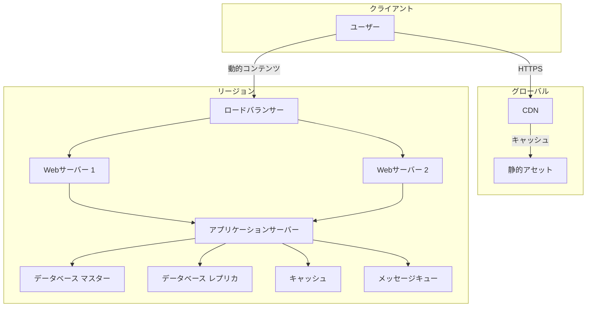

# Level 1 — インフラの基礎と構成要素 { #level1 }
{ .icon style="color:#3B82F6" }

!!! abstract "この章で学ぶこと"
    - インフラストラクチャの主要コンポーネントを理解する
    - ネットワークの基本プロトコル（HTTP/DNS/SSL）を理解する
    - クラウド時代のインフラ構成の考え方を身につける

## 1-A 基本概念

現代のウェブアプリケーションは、複数のコンポーネントが連携して動作しています。代表的な構成要素として、Webサーバー、アプリケーションサーバー、データベース、キャッシュ、キュー、CDNなどがあります。

### ネットワークの基本三要素
1. **IPアドレス**: ネットワーク上の機器を一意に識別
2. **プロトコル**: 通信のルール（例: TCP/IP, HTTP, DNS）
3. **ポート番号**: 1台のサーバーで複数のサービスを識別

### サーバーレスと仮想化
- **サーバーレス**: インフラ管理をクラウドプロバイダーに委譲し、コード実行に集中
- **仮想化**: 1台の物理サーバーを複数の仮想マシンに分割して効率化
- **コンテナ**: アプリケーションと依存関係をパッケージ化する軽量な仮想化技術

これらのコンポーネントは、それぞれが独立した役割を持ちつつ、互いに連携してサービスを提供します。例えば、ユーザーがウェブサイトにアクセスすると、まずDNSでIPアドレスが解決され、ロードバランサーを経由してWebサーバーにリクエストが届きます。

### 監視の二つの視点
1. **死活監視**: サービスが動いているかどうかの確認
2. **傾向監視**: パフォーマンスの変動やリソース使用量の推移を追跡

### アカウント管理の基本
- 最小権限の原則に基づくアクセス制御
- root権限の適切な管理
- 多要素認証の導入

## 1-B 代表コンポーネント表

| カテゴリ | 代表例 | 主な役割 | 特徴 |
|----------|--------|----------|------|
| **Webサーバー** | Nginx, Apache | HTTPリクエストの受付・静的コンテンツ配信 | リバースプロキシとしても機能 |
| **アプリケーションサーバー** | Gunicorn, uWSGI | アプリケーションの実行環境 | 動的コンテンツ生成 |
| **リレーショナルDB** | PostgreSQL, MySQL | 構造化データの永続化 | ACID特性を保証 |
| **NoSQL DB** | MongoDB, DynamoDB | スキーマレスなデータ保存 | 水平スケーリングに優れる |
| **KVS** | Redis, Memcached | インメモリ型データストア | 高速な読み書きが可能 |
| **メッセージキュー** | RabbitMQ, Kafka | 非同期処理のためのメッセージ仲介 | サービス間連携に利用 |
| **CDN** | CloudFront, Fastly | コンテンツ配信の最適化 | エッジロケーションで高速配信 |
| **ロードバランサー** | ALB, NLB | トラフィック分散 | 高可用性を実現 |
| **サーバーレス** | AWS Lambda, GCP Functions | イベント駆動型のコンピューティング | スケーラブルで管理不要 |
| **分散ストレージ** | S3, GCS | オブジェクトストレージ | 99.999999999%の耐久性、マルチAZ構成 |

### 分散ストレージの特徴

- **フォールトトレラント設計**: データを複数のアベイラビリティゾーン(AZ)に自動的に複製し、1つの障害が全体のサービス停止に繋がらないようにします。
- **CAP定理のトレードオフ**: 分散システムでは「一貫性(Consistency)」「可用性(Availability)」「分断耐性(Partition tolerance)」の3つのうち2つしか同時に満たせません。例えば、S3は高可用性と分断耐性を優先し、結果整合性モデルを採用しています。
- **スケーラビリティ**: ペタバイト級のデータを水平分散して保存可能で、トラフィック増加に応じて自動的にスケールします。
- **コスト効率**: オンデマンド課金モデルで、使用した分だけのコストで済みます。

## 1-C ケーススタディ & アーキテクチャ図

### GitHubの初期アーキテクチャ

GitHubの初期の2層アーキテクチャは、シンプルながらも堅牢な設計で知られています。

**構成要素**:
- **フロントエンド層**: Nginx (ロードバランサー + 静的ファイル配信)
- **アプリケーション層**: Railsアプリケーション (Unicorn)
- **データ層**: MySQL (マスタースレーブ構成)
- **キャッシュ層**: Memcached
- **非同期処理**: Resque (Redisベースのキュー)

**特徴**:
- シンプルな構成でスケーラビリティを確保
- ステートレスな設計による水平スケーリング
- キャッシュ戦略によるパフォーマンス最適化

**学び**: シンプルな設計から始め、必要に応じて複雑化していく進化的アーキテクチャの好例です。

### アーキテクチャ図



## 1-D ハンズオン概要

!!! tip "Lab 1: シンプルなWebアプリケーションのデプロイ"
    NginxとNode.jsを使ったシンプルなWebアプリケーションをDocker Composeで構築します。
    
    ```bash
    # プロジェクトディレクトリの作成
    mkdir -p my-webapp/{nginx,app}
    
    # Nginx設定ファイルの作成
    cat > my-webapp/nginx/default.conf << 'EOL'
    server {
        listen 80;
        server_name localhost;
        
        location / {
            proxy_pass http://app:3000;
            proxy_http_version 1.1;
            proxy_set_header Upgrade $http_upgrade;
            proxy_set_header Connection 'upgrade';
            proxy_set_header Host $host;
            proxy_cache_bypass $http_upgrade;
        }
    }
    EOL
    
    # Node.jsアプリケーションの作成
    cat > my-webapp/app/server.js << 'EOL'
    const http = require('http');
    const os = require('os');
    
    const server = http.createServer((req, res) => {
        res.writeHead(200, { 'Content-Type': 'text/plain' });
        res.end(`Hello from ${os.hostname()}\n`);
    });
    
    server.listen(3000, '0.0.0.0');
    console.log('Server running at http://0.0.0.0:3000/');
    EOL
    
    # Docker Composeファイルの作成
    cat > my-webapp/docker-compose.yml << 'EOL'
    version: '3'
    
    services:
      nginx:
        image: nginx:alpine
        ports:
          - "8080:80"
        volumes:
          - ./nginx:/etc/nginx/conf.d
          - static:/var/www/static
        depends_on:
          - app
      
      app:
        build: ./app
        volumes:
          - ./app:/usr/src/app
        working_dir: /usr/src/app
        environment:
          - NODE_ENV=development
    
    volumes:
      static:
    EOL
    
    # アプリケーションのDockerfile
    cat > my-webapp/app/Dockerfile << 'EOL'
    FROM node:16-alpine
    WORKDIR /usr/src/app
    COPY package*.json ./
    RUN npm install
    COPY . .
    CMD ["node", "server.js"]
    EOL
    
    # アプリケーションの起動
    cd my-webapp
    docker compose up -d
    ```

## 1-E ケーススタディ: GitHubの初期構成

GitHubは2008年のローンチ当初、2層構成のシンプルなアーキテクチャを採用していました。Nginxをフロントエンドに配置し、Ruby on RailsアプリケーションとMySQLデータベースで構成されていました。この構成は、初期の段階では十分なパフォーマンスを発揮しましたが、ユーザー数の増加に伴い、データベースのスケーリングが課題となりました。この経験から、GitHubは段階的にアーキテクチャを改善し、現在のマイクロサービスアーキテクチャへと発展させました。

???+ quiz "クイズ: サーバーレスアーキテクチャ"
    サーバーレスアーキテクチャの特徴として正しいのは？
    
    <ul class="quiz-options">
      <li data-correct="false" data-explain="サーバーレスでもサーバーは存在しますが、管理が不要になるという点が異なります。">物理サーバーが全く不要</li>
      <li data-correct="true" data-explain="サーバーレスでは、使用した分だけのリソースに対して課金されるため、コスト効率が良い場合が多いです。">使用量に応じた課金モデル</li>
      <li data-correct="false" data-explain="サーバーレスはステートフルな処理よりも、ステートレスな処理に適しています。">ステートフルな処理に最適</li>
      <li data-correct="false" data-explain="サーバーレスでも、コールドスタートによるレイテンシが発生する可能性があります。">常に低レイテンシが保証される</li>
    </ul>

## 1-F まとめチェックリスト

- [ ] インフラの主要コンポーネントとその役割を説明できる
- [ ] リレーショナルデータベースとNoSQLの違いを説明できる
- [ ] キャッシュの利点と使用場面を説明できる
- [ ] メッセージキューの用途を理解している
- [ ] シンプルなDocker Composeファイルを作成できる

## 章末クイズ

???+ quiz "クイズ: データベースの基本"
    リレーショナルデータベースの特徴として正しいのは？
    
    <ul class="quiz-options">
      <li data-correct="false" data-explain="スキーマレスはNoSQLデータベースの特徴です。リレーショナルデータベースは構造化されたスキーマを定義します。">スキーマレスで柔軟なデータ構造</li>
      <li data-correct="true" data-explain="リレーショナルデータベースはACID特性を備え、トランザクション処理に優れています。">トランザクション処理に優れている</li>
      <li data-correct="false" data-explain="非構造化データの処理はNoSQLデータベースの得意分野です。">大量の非構造化データに適している</li>
      <li data-correct="false" data-explain="リレーショナルデータベースは垂直スケーリングが主で、水平スケーリングは苦手とします。">水平スケーリングが得意</li>
    </ul>

???+ quiz "クイズ: ロードバランサー"
    ロードバランサーの主な役割は？
    
    <ul class="quiz-options">
      <li data-correct="true" data-explain="ロードバランサーの主な役割は、複数のサーバーにリクエストを分散し、負荷を均一に保つことです。これにより、単一障害点を防ぎ、スケーラビリティを向上させます。">トラフィックの分散</li>
      <li data-correct="false" data-explain="データの暗号化はTLS/SSLの役割で、ロードバランサーは暗号化を終端させることはできますが、主な役割ではありません。">データの暗号化</li>
      <li data-correct="false" data-explain="コンテンツのキャッシュはCDNやリバースプロキシの役割で、ロードバランサーの主な機能ではありません。">コンテンツのキャッシュ</li>
      <li data-correct="false" data-explain="ドメイン名の解決はDNSサーバーの役割です。">ドメイン名の解決</li>
    </ul>

???+ quiz "クイズ: CDNの利点"
    CDNの主な利点は？
    
    <ul class="quiz-options">
      <li data-correct="false" data-explain="CDNは静的コンテンツの配信が目的で、データベースのバックアップ機能はありません。">データベースのバックアップ</li>
      <li data-correct="false" data-explain="アプリケーションの実行はCDNの役割ではありません。CDNは静的コンテンツの配信に特化しています。">アプリケーションの実行</li>
      <li data-correct="true" data-explain="CDNは世界中に分散したエッジサーバーでコンテンツをキャッシュし、ユーザーに近い場所から配信することで高速化を実現します。">コンテンツ配信の高速化</li>
      <li data-correct="false" data-explain="ユーザー認証はアプリケーションサーバーやIDプロバイダーの役割で、CDNの機能ではありません。">ユーザー認証</li>
    </ul>

[次のレベルへ →](../ops-essentials/level2.md){ .md-button }
