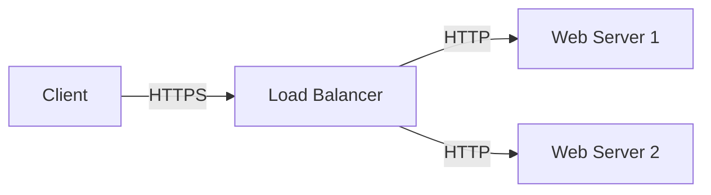

# Level 1 — Foundations { #level1 }
{ .icon style="color:#3B82F6" }

!!! abstract "学習ゴール"
    1. インフラ主要コンポーネントを説明できる  
    2. HTTP/DNS/SSL の役割を理解する  
    3. ハンズオン環境を操作できる

## コンポーネント早見表

| カテゴリ | 代表例 | ひとことで言うと |
|---|---|---|
| **Web Server** | Nginx, Apache | HTTPリクエストを処理する |
| **App Server** | Gunicorn, uWSGI | アプリケーションを実行する |
| **Database** | PostgreSQL, MySQL | 構造化データを永続化 |
| **KVS** | Redis | メモリ特化の辞書 |
| **Queue** | RabbitMQ | メッセージの行列 |
| **CDN** | CloudFront | 静的キャッシュ網 |

## ネットワーク基礎

### HTTP/HTTPS
- **HTTP (80)**: ウェブ通信の基本プロトコル
- **HTTPS (443)**: 暗号化されたHTTP通信



!!! info "用語ノート"
    ポート番号は "アプリの玄関"。HTTP=80, HTTPS=443 が標準。

### DNS の仕組み
1. ブラウザがDNSサーバーに問い合わせ
2. ドメイン名 → IPアドレス に変換
3. 接続先が決定

## ハンズオン: 初めてのWebサーバー

!!! warning "Lab 01 - Webサーバーを立ててみよう"
    Docker Compose で Nginx を起動し、ブラウザで確認します。

```bash
docker compose up -d web
```

ブラウザで `http://localhost:8080` にアクセスしてみましょう。

## 章末チェック

???+ quiz "理解度チェック"
    ? DNS が解決するのは？
    - [ ] OS バージョン
    - [x] ホスト名 → IP
    - [ ] TCP ポート
    - [ ] CPU 温度

    ? HTTPSの標準ポート番号は？
    - [ ] 80
    - [x] 443
    - [ ] 22
    - [ ] 3306

[次のレベルへ →](../ops-essentials/level2.md){ .md-button }
