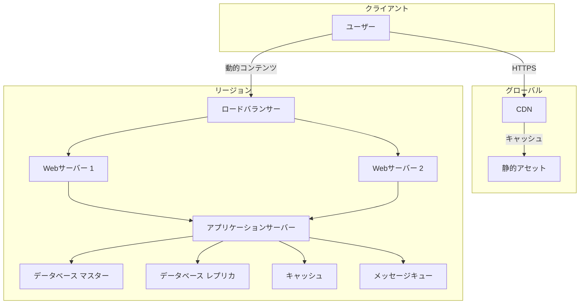

# Level 1 — インフラの基礎と構成要素 { #level1 }
{ .icon style="color:#3B82F6" }

!!! abstract "この章で学ぶこと"
    - インフラストラクチャの主要コンポーネントを理解する
    - ネットワークの基本プロトコル（HTTP/DNS/SSL）を理解する
    - クラウド時代のインフラ構成の考え方を身につける

## 1-A 基本概念

現代のウェブアプリケーションは、複数のコンポーネントが連携して動作しています。代表的な構成要素として、Webサーバー、アプリケーションサーバー、データベース、キャッシュ、キュー、CDNなどがあります。

これらのコンポーネントは、それぞれが独立した役割を持ちつつ、互いに連携してサービスを提供します。例えば、ユーザーがウェブサイトにアクセスすると、まずDNSでIPアドレスが解決され、ロードバランサーを経由してWebサーバーにリクエストが届きます。

## 1-B 代表コンポーネント表

| カテゴリ | 代表例 | 主な役割 | 特徴 |
|----------|--------|----------|------|
| **Webサーバー** | Nginx, Apache | HTTPリクエストの受付・静的コンテンツ配信 | リバースプロキシとしても機能 |
| **アプリケーションサーバー** | Gunicorn, uWSGI | アプリケーションの実行環境 | 動的コンテンツ生成 |
| **リレーショナルDB** | PostgreSQL, MySQL | 構造化データの永続化 | ACID特性を保証 |
| **NoSQL DB** | MongoDB, DynamoDB | スキーマレスなデータ保存 | 水平スケーリングに優れる |
| **KVS** | Redis, Memcached | インメモリ型データストア | 高速な読み書きが可能 |
| **メッセージキュー** | RabbitMQ, Kafka | 非同期処理のためのメッセージ仲介 | サービス間連携に利用 |
| **CDN** | CloudFront, Fastly | コンテンツ配信の最適化 | エッジロケーションで高速配信 |
| **ロードバランサー** | ALB, NLB | トラフィック分散 | 高可用性を実現 |

## 1-C アーキテクチャ図



## 1-D ハンズオン概要

!!! tip "Lab 1: シンプルなWebアプリケーションのデプロイ"
    NginxとNode.jsを使ったシンプルなWebアプリケーションをDocker Composeで構築します。
    
    ```bash
    # プロジェクトディレクトリの作成
    mkdir -p my-webapp/{nginx,app}
    
    # Nginx設定ファイルの作成
    cat > my-webapp/nginx/default.conf << 'EOL'
    server {
        listen 80;
        server_name localhost;
        
        location / {
            proxy_pass http://app:3000;
            proxy_http_version 1.1;
            proxy_set_header Upgrade $http_upgrade;
            proxy_set_header Connection 'upgrade';
            proxy_set_header Host $host;
            proxy_cache_bypass $http_upgrade;
        }
    }
    EOL
    
    # Node.jsアプリケーションの作成
    cat > my-webapp/app/server.js << 'EOL'
    const http = require('http');
    const os = require('os');
    
    const server = http.createServer((req, res) => {
        res.writeHead(200, { 'Content-Type': 'text/plain' });
        res.end(`Hello from ${os.hostname()}\n`);
    });
    
    server.listen(3000, '0.0.0.0');
    console.log('Server running at http://0.0.0.0:3000/');
    EOL
    
    # Docker Composeファイルの作成
    cat > my-webapp/docker-compose.yml << 'EOL'
    version: '3'
    
    services:
      nginx:
        image: nginx:alpine
        ports:
          - "8080:80"
        volumes:
          - ./nginx:/etc/nginx/conf.d
          - static:/var/www/static
        depends_on:
          - app
      
      app:
        build: ./app
        volumes:
          - ./app:/usr/src/app
        working_dir: /usr/src/app
        environment:
          - NODE_ENV=development
    
    volumes:
      static:
    EOL
    
    # アプリケーションのDockerfile
    cat > my-webapp/app/Dockerfile << 'EOL'
    FROM node:16-alpine
    WORKDIR /usr/src/app
    COPY package*.json ./
    RUN npm install
    COPY . .
    CMD ["node", "server.js"]
    EOL
    
    # アプリケーションの起動
    cd my-webapp
    docker compose up -d
    ```

## 1-E ケーススタディ: GitHubの初期構成

GitHubは2008年のローンチ当初、2層構成のシンプルなアーキテクチャを採用していました。Nginxをフロントエンドに配置し、Ruby on RailsアプリケーションとMySQLデータベースで構成されていました。この構成は、初期の段階では十分なパフォーマンスを発揮しましたが、ユーザー数の増加に伴い、データベースのスケーリングが課題となりました。この経験から、GitHubは段階的にアーキテクチャを改善し、現在のマイクロサービスアーキテクチャへと発展させました。

## 1-F まとめチェックリスト

- [ ] インフラの主要コンポーネントとその役割を説明できる
- [ ] リレーショナルデータベースとNoSQLの違いを説明できる
- [ ] キャッシュの利点と使用場面を説明できる
- [ ] メッセージキューの用途を理解している
- [ ] シンプルなDocker Composeファイルを作成できる

## 章末クイズ

<details class="quiz">
  <summary>クイズ: データベースの基本</summary>
  <p>リレーショナルデータベースの特徴として正しいのは？</p>
  <ul class="quiz-options">
    <li data-correct="false">スキーマレスで柔軟なデータ構造</li>
    <li data-correct="true">トランザクション処理に優れている</li>
    <li data-correct="false">大量の非構造化データに適している</li>
    <li data-correct="false">水平スケーリングが得意</li>
  </ul>
</details>

<details class="quiz">
  <summary>クイズ: ロードバランサー</summary>
  <p>ロードバランサーの主な役割は？</p>
  <ul class="quiz-options">
    <li data-correct="true">トラフィックの分散</li>
    <li data-correct="false">データの暗号化</li>
    <li data-correct="false">コンテンツのキャッシュ</li>
    <li data-correct="false">ドメイン名の解決</li>
  </ul>
</details>

<details class="quiz">
  <summary>クイズ: CDNの利点</summary>
  <p>CDNの主な利点は？</p>
  <ul class="quiz-options">
    <li data-correct="false">データベースのバックアップ</li>
    <li data-correct="false">アプリケーションの実行</li>
    <li data-correct="true">コンテンツ配信の高速化</li>
    <li data-correct="false">ユーザー認証</li>
  </ul>
</details>

[次のレベルへ →](../ops-essentials/level2.md){ .md-button }
