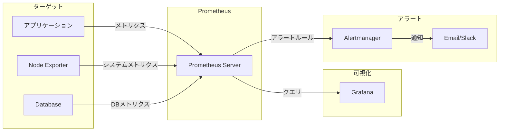

# Level 2 — Ops Routine & Monitoring { #level2 }
{ .icon style="color:#10B981" }
:tags: [cron, monitoring, linux]

!!! abstract "学習ゴール"
    1. 定期的なタスクの管理方法を理解する  
    2. 効果的な監視戦略を設計できるようになる  
    3. ログ収集・分析のベストプラクティスを学ぶ

## Cron と at コマンドの比較

| 機能 | Cron | at |
|------|------|----|
| 実行タイミング | 定期的に繰り返し | 1回のみ |
| 設定方法 | crontab -e で編集 | at コマンドで指定 |
| 使用例 | 毎日のバックアップ | メンテナンス通知 |
| 柔軟性 | 固定スケジュール | 1回限りの実行 |

Cronは定期的なタスク（バックアップ、ログローテーションなど）に最適で、atコマンドは1回限りの遅延実行に適しています。

## 監視の3つの視点

### 1. 死活監視
**目的**: サービスが正しく動作しているかどうかを確認
- ポートの応答確認
- HTTPステータスコードのチェック
- プロセスの生存確認

### 2. リソース監視
**目的**: システムリソースの使用状況を把握
- CPU使用率
- メモリ使用量
- ディスクI/O
- ネットワーク帯域

### 3. ログ監視
**目的**: 問題の早期発見と分析
- エラーログの検出
- アクセスログの分析
- セキュリティイベントの監視

## Prometheus 監視アーキテクチャ



## ハンズオン: 監視システム構築

!!! tip "Lab 02 - 監視システムを構築"
    PrometheusとGrafanaを使用して監視システムを構築します。
    
    ```bash
    # 監視システムの起動
    docker compose up -d prometheus grafana
    
    # 起動確認
    docker ps
    ```
    
    - Prometheus: http://localhost:9090
    - Grafana: http://localhost:3000 (admin/admin)

## ケーススタディ: Airbnbの監視戦略

Airbnbは、初期段階ではcronを多用していましたが、スケーラビリティの問題に直面しました。タスクの依存関係の管理や、失敗したジョブの再実行が困難だったためです。

2014年、AirbnbはAirflowを開発し、cronから移行しました。これにより：

- ワークフローの視覚化
- 依存関係の管理
- 失敗時の自動リトライ
- 実行履歴の追跡

が可能になり、データパイプラインの信頼性が大幅に向上しました。

## まとめチェックリスト

- [ ] cronとatの違いを説明できる
- [ ] 監視の3つの視点を説明できる
- [ ] Prometheusの基本的なアーキテクチャを理解している
- [ ] 監視システムの構築手順を理解している
- [ ] ログ管理のベストプラクティスを説明できる

## 理解度チェック

<details class="quiz">
  <summary>クイズ: Cronの特徴</summary>
  <p>Cronの特徴として正しいものは？</p>
  <ul class="quiz-options">
    <li data-correct="true">定期的なタスクの実行に適している</li>
    <li data-correct="false">1回限りのタスクに最適</li>
    <li data-correct="false">GUIでのみ設定可能</li>
    <li data-correct="false">Windows専用のツール</li>
  </ul>
</details>

<details class="quiz">
  <summary>クイズ: 監視の基本</summary>
  <p>システム監視において、リソース監視に含まれるのは？</p>
  <ul class="quiz-options">
    <li data-correct="true">CPU使用率</li>
    <li data-correct="true">メモリ使用量</li>
    <li data-correct="false">HTTPステータスコード</li>
    <li data-correct="true">ディスクI/O</li>
  </ul>
</details>

<details class="quiz">
  <summary>クイズ: ログ管理</summary>
  <p>ログ管理で重要な「3-2-1ルール」とは？</p>
  <ul class="quiz-options">
    <li data-correct="false">3つのログレベル、2つの保存先、1つのバックアップ</li>
    <li data-correct="true">3つのコピー、2つのメディア、1つはオフサイト</li>
    <li data-correct="false">3時間ごとのログ取得、2時間の保持、1週間のアーカイブ</li>
    <li data-correct="false">3つの監視項目、2つのアラート、1つのダッシュボード</li>
  </ul>
</details>

[次のレベルへ →](../ops-essentials/level3.md){ .md-button }
