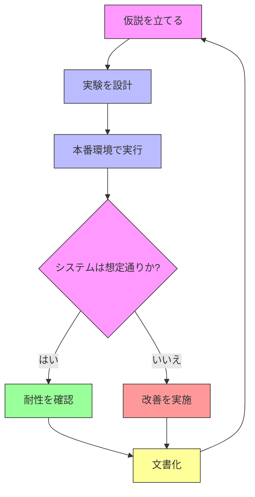

# Level 3 — Scale & High Availability { #level3 }
{ .icon style="color:#F59E0B" }
:tags: [scaling, ha, load-balancing]

!!! abstract "学習ゴール"
    1. スケーリングの基本戦略を理解する  
    2. 高可用性の仕組みと設計を学ぶ  
    3. ロードバランサーの設定と運用を習得する

## スケーリング戦略の基本

### スケールアップ vs スケールアウト

| 特徴 | スケールアップ | スケールアウト |
|------|--------------|--------------|
| 定義 | サーバーのリソースを増強 | サーバー台数を増やして分散 |
| メリット | 実装が簡単 | 可用性が高い |
| デメリット | 単一障害点のリスク | アプリケーションの対応が必要 |
| コスト | 高価になりがち | 段階的な拡張が可能 |
| 適したケース | 単一サーバーで十分な場合 | 高可用性が求められる場合 |

### 水平スケーリングのメリット
1. **耐障害性の向上**: 1台が停止しても他がカバー
2. **柔軟なリソース配分**: 需要に応じた柔軟な拡張
3. **ローリングアップデート**: ダウンタイムなしでの更新が可能

## 高可用性（HA）の基本

### 単一障害点（SPoF）分析表

| レイヤ | コンポーネント例 | 対策 |
|--------|----------------|------|
| ネットワーク | 単一ルーター | 冗長ルーターの導入 |
| ロードバランサー | 単一ALB | マルチAZ構成 + オートスケーリング |
| アプリケーション | 単一インスタンス | 複数インスタンス + オートスケーリング |
| データベース | シングルAZ RDS | マルチAZ RDS + リードレプリカ |
| ストレージ | 単一EBSボリューム | EFS/S3 + マルチAZレプリケーション |

### 高可用性を実現する3つの要素
1. **冗長化**
   - 複数のサーバーで同じサービスを提供
   - データセンターのマルチAZ構成
   - リージョンをまたがるディザスタリカバリ構成

2. **フェイルオーバー**
   - 障害発生時に自動で予備システムに切り替え
   - ヘルスチェックによる自動検知
   - RTO（目標復旧時間）とRPO（目標復旧時点）の設定

3. **負荷分散**
   - リクエストを複数サーバーに分散
   - スティッキーセッションのサポート
   - ヘルスチェックによる異常ノードの自動除外

### Terraform によるマルチAZ構成の例

```hcl
# VPCとサブネットの定義
resource "aws_vpc" "main" {
  cidr_block = "10.0.0.0/16"
  enable_dns_support = true
  enable_dns_hostnames = true
}

# パブリックサブネット（マルチAZ）
resource "aws_subnet" "public" {
  count             = 3
  vpc_id            = aws_vpc.main.id
  cidr_block        = cidrsubnet(aws_vpc.main.cidr_block, 8, count.index)
  availability_zone = data.aws_availability_zones.available.names[count.index]
}

# オートスケーリンググループ
resource "aws_autoscaling_group" "web" {
  vpc_zone_identifier = aws_subnet.public[*].id
  min_size            = 3
  max_size            = 10
  desired_capacity    = 3
  health_check_type   = "ELB"

  launch_template {
    id      = aws_launch_template.web.id
    version = "$Latest"
  }
}
```

## 高可用性クイズ

<details class="quiz">
  <summary>クイズ: 高可用性とカオスエンジニアリング</summary>
  <p>高可用性システムの設計において、正しい説明はどれですか？</p>
  <ul class="quiz-options">
    <li data-correct="false" data-explain="マルチAZ構成では、異なるデータセンターに配置されるため、1つのAZの障害が他に影響しません。">マルチAZ構成では、1つのAZの障害が他にも影響する</li>
    <li data-correct="true" data-explain="RTOは目標復旧時間、RPOは目標復旧時点のことで、災害復旧計画の重要な指標です。">RTOとRPOは災害復旧計画の重要な指標である</li>
    <li data-correct="false" data-explain="カオスエンジニアリングは本番環境でのみ実施する必要はなく、ステージング環境でも実施可能です。">カオスエンジニアリングは本番環境でのみ実施すべき</li>
    <li data-correct="false" data-explain="オートスケーリングはスループットの向上だけでなく、コスト最適化のためにも使用されます。">オートスケーリングはスループット向上のみが目的</li>
  </ul>
</details>

## カオスエンジニアリング

### カオスエンジニアリングの基本



### カオスエンジニアリングの実践例

| テスト | 目的 | 想定される影響 |
|-------|------|--------------|
| インスタンス停止 | 冗長性の検証 | 他ノードへの自動フェイルオーバー |
| ネットワーク遅延 | レイテンシ耐性 | タイムアウト設定の検証 |
| CPU負荷上昇 | オートスケーリング検証 | 自動スケールアウトの確認 |
| AZ障害 | マルチAZ構成の検証 | 他AZへの自動フェイルオーバー |

## ロードバランサーの基本

### ロードバランサーの種類
1. **L4（レイヤー4）**
   - TCP/UDPレベルで動作
   - 高速だが、アプリケーション層の情報は見れない

2. **L7（レイヤー7）**
   - HTTP/HTTPSレベルで動作
   - URLパスやヘッダーに基づいたルーティングが可能

### ロードバランシングアルゴリズム
- ラウンドロビン
- リーストコネクション
- ソースIPハッシュ
- 最小応答時間

## ハンズオン: HAProxy による負荷分散

!!! tip "Lab 03 - ロードバランサーを設定"
    HAProxy を使って複数のWebサーバーに負荷分散します。
    
    ```bash
    # 3つのWebサーバーインスタンスを起動
    docker compose up -d --scale app=3 haproxy
    
    # ステータス確認
    docker ps
    ```
    
    - HAProxy Stats: http://localhost:1936 (admin:admin)
    - アプリケーション: http://localhost:8080

## ケーススタディ: Netflixのスケーリング戦略

Netflixは、マイクロサービスアーキテクチャとクラウドネイティブな設計により、世界中の1億人以上のユーザーにサービスを提供しています。

**主な取り組み**:
- すべてのサービスをステートレスに設計
- リージョン間のレイテンシーを考慮したマルチリージョン展開
- カオスエンジニアリングによる耐障害性テスト

## まとめチェックリスト

- [ ] スケールアップとスケールアウトの違いを説明できる
- [ ] 高可用性を実現する3つの要素を理解している
- [ ] ロードバランサーの種類と特徴を説明できる
- [ ] HAProxyの基本的な設定ができる
- [ ] 障害発生時の対応フローを理解している

## 理解度チェック

<details class="quiz">
  <summary>クイズ: スケーリング戦略</summary>
  <p>スケールアウトのメリットとして正しいものは？</p>
  <ul class="quiz-options">
    <li data-correct="true">耐障害性が向上する</li>
    <li data-correct="false">サーバー1台あたりの処理能力が向上する</li>
    <li data-correct="false">初期コストが安い</li>
    <li data-correct="false">メンテナンスが簡単</li>
  </ul>
</details>

<details class="quiz">
  <summary>クイズ: ロードバランサー</summary>
  <p>L7ロードバランサーの特徴として正しいものは？</p>
  <ul class="quiz-options">
    <li data-correct="true">HTTPヘッダーに基づいたルーティングが可能</li>
    <li data-correct="false">TCPレベルでのみ動作する</li>
    <li data-correct="false">SSL終端ができない</li>
    <li data-correct="false">レイヤー4で動作する</li>
  </ul>
</details>
<details class="quiz">
  <summary>クイズ: 高可用性</summary>
  <p>高可用性を実現するための要素でないものは？</p>
  <ul class="quiz-options">
    <li data-correct="false">冗長化</li>
    <li data-correct="false">フェイルオーバー</li>
    <li data-correct="true">単一障害点の導入</li>
    <li data-correct="false">ヘルスチェック</li>
  </ul>
</details>
